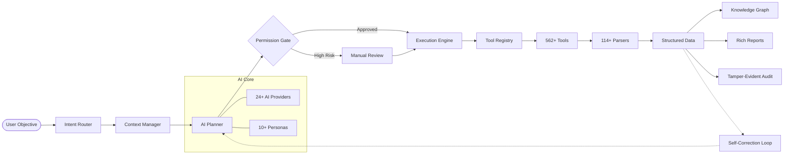

<p align="center">
  
</p>

<h1 align="center">Siyarix</h1>

<p align="center">
  <b>CLI-Based AI-Native Command Center for Modern Cybersecurity Operations</b><br/>
  Orchestrate complex security workflows using natural language across 24+ AI providers, 
  a massive 562+ tool registry, and 114+ specialized output parsers.
</p>

<p align="center">
  <a href="https://github.com/mufthakherul/siyarix">
    
  </a>
  <a href="https://github.com/mufthakherul/siyarix/releases">
    
  </a>
  <a href="https://github.com/mufthakherul/siyarix/blob/main/LICENSE">
    
  </a>
  <a href="https://github.com/mufthakherul/siyarix/actions/workflows/ci.yml">
    
  </a>
  <a href="https://pypi.org/project/siyarix/">
    
  </a>
  <a href="https://www.codefactor.io/repository/github/mufthakherul/siyarix">
    
  </a>
</p>

<p align="center">
  <a href="https://github.com/mufthakherul/siyarix/graphs/contributors">
    
  </a>
  <a href="https://github.com/mufthakherul/siyarix/commits/main">
    
  </a>
  <a href="https://github.com/mufthakherul/siyarix">
    
  </a>
  <a href="https://github.com/mufthakherul/siyarix/issues">
    
  </a>
  <a href="https://github.com/mufthakherul/siyarix/pulls?q=is%3Apr+is%3Aclosed">
    
  </a>
  <a href="https://pypi.org/project/siyarix/">
    
  </a>
</p>

<p align="center">
  <a href="#overview">Overview</a> •
  <a href="#siyarix-by-the-numbers">Stats</a> •
  <a href="#features">Features</a> •
  <a href="#quick-start">Quick Start</a> •
  <a href="docs/DOCS_MAP.md">Documentation</a>
</p>

---

## Overview

Meet **Siyarix**, your new AI-native cybersecurity operations platform. Think of it as a brilliant security analyst sitting right in your terminal, acting as your personal AI orchestration agent. 

Siyarix bridges the gap between your natural language security goals and the complex, deterministic execution of command-line tools. Just tell Siyarix what you need in plain English—like *"scan this subnet for open ports"*—and it intelligently routes your request through a robust, multi-provider AI engine. It drafts a safe execution plan, runs the right local security tools, and delivers clean, precise, and actionable results.

### The Lifecycle of a Request



---

## Siyarix by the Numbers

We believe in transparency and measurable performance. Siyarix is built to handle security at scale.

| Category | Statistic |
|----------|-----------|
| 🧠 **AI Intelligence** | **24+** AI Providers with auto-failover & circuit breakers |
| 🛠️ **Tool Registry** | **562+** Security tools recognized and mapped |
| 📊 **Data Extraction** | **114+** Specialized parsers for structured insights |
| 🛡️ **Safety Rules** | **38+** Critical danger patterns blocked by default |
| 👤 **Security Personas** | **10** Specialized mindsets (Red Team, Blue Team, DFIR, etc.) |
| 🕹️ **Interaction Modes** | **9** Distinct ways to interact (Chat, API, Autonomous, etc.) |
| 🧪 **Test Coverage** | **100+** Automated unit & E2E tests |
| 🚀 **Quality Assurance** | **47+** CI/CD workflows running on every commit |

---

## Key Features

### 🧠 Intelligent AI Orchestration
- **Multi-Provider Routing**: Dynamically switch between OpenAI, Gemini, Anthropic, or local models (Ollama/LM Studio).
- **Multi-Model Ensemble**: Parallel LLM voting strategies for critical decision-making.
- **Goal-Driven Agents**: Autonomous "Observe-Reason-Act" loop for complex objectives.

### 🛠️ Deep Security Integration
- **Universal Tool Registry**: Automatic discovery and capability tagging for over 562 security tools.
- **Extreme Parsing Engine**: Converts raw terminal noise into structured JSON, YAML, or Markdown.
- **Knowledge Graph**: Builds an in-memory relationship model of your infrastructure as it scans.

### 🛡️ Built-in Safety & OPSEC
- **Two-Stage Permission Gate**: Every AI-generated command is analyzed for danger before you see it.
- **Encrypted Credential Vault**: AES-256-GCM storage for all your API keys and secrets.
- **Tamper-Evident Audit Log**: Every action is recorded in a cryptographically chained audit trail.
- **Stealth Mode**: Built-in features for TOR routing and honeypot detection.

---

## Quick Start

The first time you run Siyarix, it will automatically launch an interactive **Onboarding Wizard** to help you configure your environment, AI providers, and security tools.

```bash
# Install via pip
pip install siyarix

# Launch the interactive session (triggers onboarding on first run)
siyarix

# Quick scan
siyarix scan quick example.com

# Natural language command
siyarix run "enumerate services on 10.0.0.1"

# Goal-driven autonomous agent
siyarix agent "find all vulnerabilities on our web server"

# System health check
siyarix health
```

---

## Installation

```bash
pip install siyarix
```

For more options (Homebrew, npm, Winget, Docker) and optional extras for specific AI providers, see our [Installation Guide](docs/getting-started/installation.md).

---

## Documentation

Our documentation is comprehensive and designed to get you from beginner to expert in no time.

| Section | What's inside? |
|---------|----------------|
| [**Getting Started**](docs/getting-started/installation.md) | Installation, Setup, Onboarding, and Troubleshooting. |
| [**User Guide**](docs/user/cli-commands.md) | CLI Reference, Workflows, Cloud/IaC/Mobile/IoT scanning. |
| [**AI Internals**](docs/ai/agent-reasoning.md) | How the brain works: Routing, Personas, and Reasoning. |
| [**Architecture**](docs/architecture/overview.md) | System design, Execution engine, and Security model. |
| [**Security & Ethics**](docs/security/ethical-hacking-policy.md) | Ethical use, Threat models, and OPSEC. |

---

## Safety & Ethical Use

Siyarix is designed for **authorized security testing, research, and defensive operations only**. It must not be used against systems without explicit, documented permission. All actions are logged to a tamper-evident audit trail to ensure accountability.

See [ETHICAL_USE.md](ETHICAL_USE.md) and [RESPONSIBLE_AI_USE.md](RESPONSIBLE_AI_USE.md) for more.

---

## Author

**MD MUFTHAKHERUL ISLAM MIRAZ**

[github.com/mufthakherul/siyarix](https://github.com/mufthakherul/siyarix) | [siyarix.dev](https://siyarix.dev)

---

## License

Siyarix is released under the **GNU Affero General Public License v3.0 or later** (AGPL-3.0-or-later). See the [LICENSE](LICENSE) file for full details.

---

*Transforming how the world performs security operations, one command at a time.*
