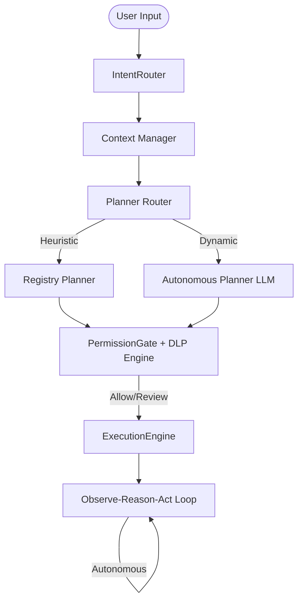

# 🤖 AI Agent Pipeline Architecture

Welcome to the heart of Siyarix! The AI agent pipeline is the central nervous system that takes user inputs and transforms them into intelligent, goal-driven actions. 

Orchestrated by the `AgentCore`, this pipeline processes every request through a structured, highly secure lifecycle: **Plan → Execute → Observe-Reason-Act**. It supports four different operational modes and features an autonomous feedback loop, budget checking, and multi-wave execution to ensure your goals are met safely and efficiently.

---

## 🔄 The Agent Lifecycle

Think of the lifecycle as a well-oiled factory assembly line. Each request goes through a series of checkpoints to ensure it is understood, planned, validated, and executed correctly.

> [!NOTE]
> The diagram above simplifies the flow, but in reality, the `PermissionGate` and `DLP Engine` act as a unified security checkpoint, not sequential steps.

---

## 🎯 Stage 1: Intent Routing

The very first step is understanding what the user wants. The `IntentRouter` classifies the input by looking for specific keywords to determine the operational mode, risk tier, and latency expectations.

| Keyword | Mode | Risk Tier | Latency |
|---------|------|-----------|---------|
| `scan`, `nmap`, `port scan` | **scan** | MEDIUM | ~0ms |
| `recon`, `enumerate`, `discover` | **recon** | LOW | ~0ms |
| `web`, `http`, `nikto`, `nuclei` | **web** | MEDIUM | ~0ms |
| `brute`, `crack`, `password` | **brute** | HIGH | ~0ms |
| `exploit`, `metasploit`, `attack` | **exploit** | HIGH | ~0ms |

Once classified, the router produces an `IntentRoute` that specifies the mode, risk tier, and whether human confirmation is required before proceeding.

---

## 🧠 Stage 2: Context Building

Before the AI can plan, it needs to understand the current situation. The **Context Manager** gathers all necessary background information to create the LLM's context window.

Here's what goes into the context:
- **Conversation History:** A rolling window of up to 300 recent messages.
- **Knowledge Graph Summaries:** Information about known entities (e.g., target IPs, domains).
- **Current Phase:** Where we are in the operation.
- **Tool Availability:** What tools can be used right now.
- **Session Metadata:** Information about the target, mode, and previous findings.

> [!TIP]
> To keep things fast and within token limits, the **CompactionEngine** actively compresses and optimizes this context before it reaches the planner.

---

## 📝 Stage 3: Planning

Once the context is set, the system needs a plan of action. The **Planner Router** decides which planning strategy to use based on the current mode.

### 🛠️ RegistryPlanner (Heuristic & Deterministic)
Used in `registry` or `offline` modes. 
- **How it works:** Maps intents directly to pre-defined plan templates using a keyword index.
- **Why it's great:** With over 500 multi-word intent patterns, it's fast, deterministic, and requires no AI. It acts as a bulletproof fallback in air-gapped or offline environments.

### 🤖 AutonomousPlanner (LLM-Driven)
Used in `autonomous` mode.
- **How it works:** Feeds the intent, compressed context, and available tools to an AI model.
- **Why it's great:** It returns a structured `ExecutionPlan` detailing exactly which tools to run, in what order, and with what arguments. It even includes self-healing capabilities (`ToolCallRepair`) if the LLM makes a syntax mistake!

---

## 🛡️ Stage 4: Permission Gating & DLP

Security is our top priority. Before any plan is executed, every single step must pass through our unified security layer.

1. **Syntax Validation:** Checks for dangerous patterns like shell injections, null bytes, or invalid target formats.
2. **Danger Analysis:** Scans against 38+ signatures for destructive or high-risk behaviors.
3. **Data Leak Prevention (DLP):** Inspects the plan using 24+ signatures to ensure sensitive data isn't accidentally leaked or transmitted improperly.

**Possible Outcomes:**
- 🟢 **ALLOW:** The action is safe and proceeds immediately.
- 🟡 **REVIEW:** The action is risky and requires manual user confirmation.
- 🔴 **BLOCK:** The action violates core safety rules and is permanently denied and logged.

> [!IMPORTANT]  
> If you are running in `strict` safety mode, many actions will default to `REVIEW` or `BLOCK` to ensure maximum safety.

---

## ⚙️ Stage 5: Execution

Now it's time to turn the plan into reality! The execution subsystem handles the heavy lifting:

1. **Validate:** `BaseExecutor` double-checks the plan structure and ensures you have enough budget left.
2. **Check Integrity:** The `Validator` ensures all tools are installed and arguments are correct.
3. **Dispatch:** The `AsyncWorkerPool` runs the steps concurrently (but within safe limits).
4. **Parse Output:** Results are routed through tool-specific parsers.
5. **Extract Knowledge:** Important findings are saved directly into the Knowledge Graph.
6. **Handle Errors:** If something breaks, the system can gracefully `RETRY`, `SKIP`, or try an `ALTERNATIVE`.

We use two main executors:
- `RegistryExecutor`: For deterministic, template-driven execution.
- `AutonomousExecutor`: For full autonomy, capable of looping until the objective is met.

---

## ♾️ Stage 6: Observe-Reason-Act Loop (Autonomous Mode)

When running in `AUTONOMOUS` mode, the agent doesn't just run a script and stop. It thinks, adapts, and reacts using the **Observe-Reason-Act** loop.

> [!NOTE]  
> Unlike traditional architectures, reflection and learning are built natively into this loop rather than existing as a separate stage.

1. 👁️ **Observe:** Collects environment state, tool outputs, scan results, and any errors.
2. 🧠 **Reason:** Analyzes these findings, updates the Knowledge Graph, and uses the LLM to decide the absolute best next move.
3. ⚡ **Act:** Executes the chosen commands, runs tools, or even delegates tasks to specialized sub-agents.

**When does the loop end?**
The agent will keep working until:
- The objective is successfully achieved (verified by the LLM).
- It hits the maximum iteration limit (default is 10 loops).
- The session budget (tokens or cost) runs out.
- The user manually interrupts the process (e.g., hitting `Ctrl+C`).
- The Permission Gate blocks a critical action.

---

## 🌊 Multi-Wave Execution

Some tasks require deep, progressive exploration. The `AgentCore.execute_multi_wave()` method handles this brilliantly.

Each "wave" executes the goal using the context and findings from the previous waves. It continuously feeds newly discovered intelligence back into the next wave, stopping only when no new findings are uncovered.

---

## 💰 Budget Checking

To prevent runaway costs or endless loops, the pipeline enforces strict session-level limits. Before any major action, `_check_budget()` ensures we are within safe operating bounds.

| Limit | Default | Environment Variable |
|-------|---------|---------------------|
| Max tokens per session | 100,000 | `SIYARIX_MAX_TOKENS` |
| Max cost per session | $2.00 | `SIYARIX_MAX_COST_USD` |

> [!WARNING]  
> If the limit is reached, the agent will throw a `BudgetExceededError` and immediately pause operations. You can adjust these limits via your environment variables.

---

## 📡 Streaming Event System

As the pipeline runs, you're never left in the dark. All stages emit real-time events through the **EventBus**. 

Some key events include:
- `AGENT_START`: The agent has woken up.
- `PLAN_CREATED`: A plan of attack has been formulated.
- `PLAN_STEP_START`: A specific tool or command is starting.
- `PLAN_STEP_FAILED`: Something went wrong (the agent will try to recover!).
- `AGENT_COMPLETE`: The mission is over.

---

## 🏁 Outputs & Results

Once the pipeline finishes its work, it doesn't just dump raw text. It produces beautifully structured, highly useful artifacts:

| Output | Destination | Format |
|--------|-------------|--------|
| **Findings** | KnowledgeGraph | In-memory directed graph |
| **Report** | ReportEngine | Markdown, HTML, JSON (with CVSS scoring) |
| **Audit Trail** | AuditLogger | Tamper-evident SHA-256 chain |
| **Session Log** | ChatSession | JSONL tree format |
| **Metrics** | MetricsCollector | Execution metrics & statistics |
| **Offline Backup**| OfflineStore | SQLite WAL mode |
| **Learned Skills**| Continuous Learning | SQLite + anonymized patterns |
