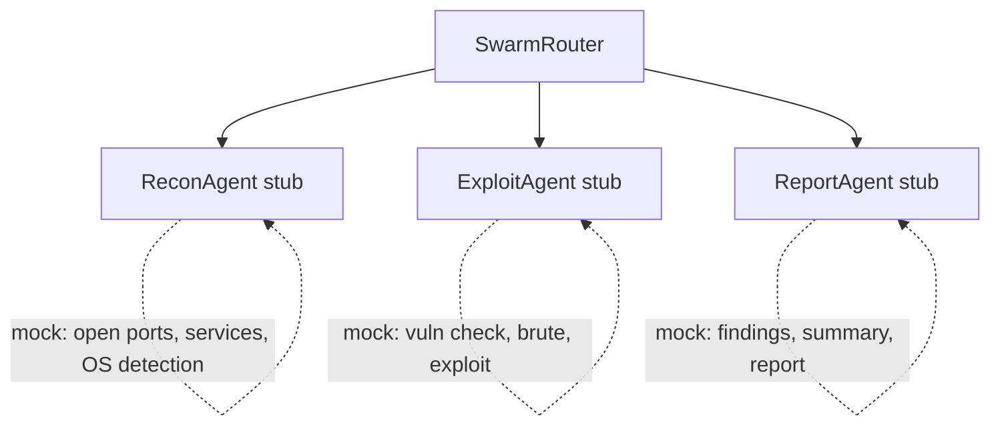

# 🤖 Multi-Agent Framework (Experimental / Stub)

!!! note
    👋 **Hey there!** Siyarix is a personal passion project built by a single developer that is growing and under active development. Some of the architectural components and features described on this page might currently be **Planned, Work in Progress, or basic implementations**. Stay tuned as it evolves! 🚀


Welcome to the **Multi-Agent Framework** in Siyarix! 👋 This section provides a foundational stub implementation for our upcoming multi-agent collaboration features.

!!! warning "Status: EXPERIMENTAL — STUB IMPLEMENTATION"

    This framework is currently a placeholder infrastructure intended for future development. It is **not yet production-ready** and should not be relied upon for operational use. All agents currently return mock data and are not connected to real tool execution.

---

## 🏗️ Architecture Overview

The architecture is designed around a central orchestrator, the `SwarmRouter`, which manages various specialized agents.



!!! note
    Currently, all agents simulate execution by sleeping for 2 seconds and returning hardcoded mock data.

---

## 🧩 Core Components (`siyarix/core/swarm.py`)

### 🚦 `SwarmRouter`

The `SwarmRouter` is the heart of our multi-agent workflow. It accepts a specific goal, selects the most appropriate agents, and returns the aggregated results from their tasks.

```python
router = SwarmRouter(provider="openai")
results = await router.run(goal="Scan 10.0.0.1 for vulnerabilities")
```

!!! tip
    The `run` method returns a list of `SwarmTask` results from each agent involved in achieving the goal.

### 🕵️ `SpecializedAgent` (Base Class)

All specialized agents inherit from the `SpecializedAgent` base class, establishing a consistent and predictable structure:

```python
@dataclass
class SpecializedAgent:
    name: str
    description: str
    provider: str
    max_iterations: int = 3

    async def run(self, goal: str, context: dict) -> SwarmTask:
        ...
```

### 📋 `SwarmTask`

A `SwarmTask` represents a specific unit of work assigned to an agent. It tracks the progress and outcome of the task.

```python
@dataclass
class SwarmTask:
    agent: str
    goal: str
    status: str          # pending | running | completed | failed
    result: str
    findings: list
    error: str | None
    started_at: float
    completed_at: float
    duration_ms: float
```

---

## 🎭 Available Agents (Stubs)

Here are the agents currently stubbed out in the framework:

### 🔍 ReconAgent

| Aspect | Details |
|--------|---------|
| **Intent** | Network reconnaissance |
| **Description** | Scans for open ports, running services, and performs OS detection on the target. |
| **Provider** | `openai` |
| **Actual Behavior** | Sleeps 2s, then returns a hardcoded mock containing open ports (22, 80, 443, 3306, 8080), services, and OS detection info. |
| **Readiness** | ❌ Not functional |

### 💥 ExploitAgent

| Aspect | Details |
|--------|---------|
| **Intent** | Vulnerability exploitation |
| **Description** | Checks for known vulnerabilities, performs brute-force attacks, and attempts exploits. |
| **Provider** | `openai` |
| **Actual Behavior** | Sleeps 2s, then returns a hardcoded mock detailing simulated vulnerabilities and exploit attempts. |
| **Readiness** | ❌ Not functional |

### 📝 ReportAgent

| Aspect | Details |
|--------|---------|
| **Intent** | Report generation |
| **Description** | Analyzes all findings and generates comprehensive, actionable reports. |
| **Provider** | `openai` |
| **Actual Behavior** | Sleeps 2s, then returns a hardcoded mock featuring findings, a summary, and a severity assessment. |
| **Readiness** | ❌ Not functional |

---

## 🛠️ Additional Stubs (`siyarix/chat/stubs.py`)

The `chat/stubs.py` module houses extra stubs used specifically for CLI chat demonstrations and testing:

- 🤖 **SimulatedAgent**: Returns mock responses to mimic different agent behaviors and personalities.
- 🤝 **SimulatedCollaboration**: Provides stubs to demonstrate multi-agent collaboration scenarios.
- 🎯 **SimulatedFindings**: Contains pre-defined mock findings used for predictable testing.

!!! danger
    These stubs are meant **exclusively** for development and demonstration purposes. They should never be used in production execution.

---

## 🚧 Current Limitations

Since this is an experimental stub, there are several limitations to be aware of:

| Limitation | Detail |
|------------|--------|
| **No inter-agent communication** | Agents currently operate in isolation and don't share findings or coordinate. |
| **No state machine** | There is no true lifecycle management (e.g., idle → running → completed). |
| **No AgentMessage protocol** | A structured messaging system between agents hasn't been implemented yet. |
| **No real tool access** | All results are currently mocked or hardcoded. |
| **Fixed 2s sleep** | Concurrency is merely simulated using a standard sleep, not real asynchronous execution. |
| **No task decomposition** | Goals are passed as-is; agents cannot break them down into smaller sub-tasks. |
| **No result passing** | The output from one agent is not currently fed into another (e.g., Agent A → Agent B). |
| **No error propagation** | Failures are captured but not dynamically acted upon by the system. |

---

## 🚀 Planned Capabilities (Future)

We have exciting plans to evolve this framework! Here’s what’s on the roadmap:

- ✨ **Dynamic agent spawning** based on the complexity of the assigned goal.
- 📬 **Inter-agent message bus** utilizing a robust publish/subscribe model.
- 🧠 **Task decomposition** powered by LLM planning.
- 🕸️ **Sharing KnowledgeGraph** across all active agents.
- 🔗 **Sequential chaining** to manage complex output dependencies.
- 🔄 **Agent lifecycle management**, complete with health checks and automatic restarts.
- 🛠️ **Real tool delegation** executed through a `RegistryExecutor`.
- 🌐 **Sub-agent coordination** designed for large-scale, intricate operations.

---

## 🔌 Integration with AgentCore

The Swarm framework is designed to be highly modular and opt-in.

```python
class AgentCore:
    def __init__(self, swarm: SwarmRouter | None = None):
        self.swarm = swarm  # Injected, not created by default

    async def run_swarm(self, goal: str) -> list[SwarmTask]:
        if not self.swarm:
            logger.warning("No SwarmRouter configured")
            return []
        return await self.swarm.run(goal)
```

!!! info
    The Swarm router is injected from the outside. `AgentCore` does **not** create a `SwarmRouter` by default, ensuring the system remains lightweight when multi-agent features are not required.

---

## 🎯 Future Use Cases

Once fully realized, the Multi-Agent Framework will support powerful scenarios:

| Scenario | Agents Involved | Future Flow |
|----------|----------------|-------------|
| **Full pentest of a single host** | Recon → Exploit → Report | Sequential chaining of agents. |
| **Network segment assessment** | Recon (scaling) → Report | Scaled reconnaissance followed by consolidated analysis. |
| **Multi-vector attack** | Recon → Exploit (multiple) → Report | Parallel exploitation across different attack vectors. |
| **Continuous monitoring** | Recon (scheduled) → Report | Periodic, automated execution and reporting. |
