# System Architecture Overview

Siyarix v3.0.0 is an AI-native cybersecurity operations platform that bridges natural language intent with deterministic tool execution. The architecture follows a layered orchestration model where an **AgentCore** dispatches across four operational modes, routing intent through planners, gates, executors, and persistence layers.

---

## High-Level Architecture

```mermaid
graph LR
    %% ===== ENTRY LAYER =====
    User([Operator / TTY]) --> CLI
    User --> REPL
    User --> API
    
    CLI[CLI / Typer]:::entry
    REPL[REPL / prompt_toolkit]:::entry
    API[REST API / FastAPI]:::entry
    WS[WebSocket / v1/stream]:::entry
    PIPELINE[Pipeline / chained]:::entry
    BATCH[Batch / script mode]:::entry
    
    CLI --> AgentCore
    REPL --> AgentCore
    API --> AgentCore
    WS --> AgentCore
    PIPELINE --> AgentCore
    BATCH --> AgentCore

    %% ===== ORCHESTRATION LAYER =====
    subgraph ORCH["Orchestration Layer"]
        AgentCore[AgentCore Orchestrator]:::core
        IR[IntentRouter]:::core
        NLP[NLP Engine / zero-dep]:::core
        CtxMgr[Context Manager]:::core
        Comp[Compaction Engine]:::core
        
        AgentCore -->|dispatch| IR
        IR -->|classify intent| NLP
        IR -->|route| PlannerRouter
        NLP -->|semantic parse| PlannerRouter
        
        subgraph Modes["AgentCore Modes"]
            REG[REGISTRY]
            AUTO[AUTONOMOUS]
            HYB[HYBRID]
            INT[INTERACTIVE]
        end
        AgentCore --> Modes
    end

    %% ===== PLANNING LAYER =====
    subgraph PLAN["Planning Layer"]
        PlannerRouter[Planner Router]:::plan
        RP[RegistryPlanner]:::plan
        AP[AutonomousPlanner]:::plan
        PR[PlannerRegistry / templates]:::plan
        
        PlannerRouter --> RP
        PlannerRouter --> AP
        RP -->|template match| PR
        AP -->|LLM generate| ProviderMgr
    end

    %% ===== PROVIDER LAYER =====
    subgraph PROV["AI Provider Layer"]
        ProviderMgr[ProviderManager]:::prov
        OA[OpenAICompat Adapter]:::prov
        PS[ProviderStateManager]:::prov
        UT[UsageTracker]:::prov
        PL[ModelAliases]:::prov
        
        ProviderMgr --> OA
        ProviderMgr --> PS
        ProviderMgr --> UT
        OA --> PL
        
        subgraph Cloud["Cloud Providers"]
            OAI[OpenAI / GPT]
            ANT[Anthropic / Claude]
            GEM[Google Gemini]
            DS[DeepSeek]
            GROQ[Groq]
            MIST[Mistral AI]
            TGT[Together AI]
            OAR[OpenRouter]
            PERP[Perplexity]
            XAI[xAI / Grok]
            CBR[Cerebras]
            FWR[Fireworks AI]
            HF[HuggingFace]
            MIMO[MiniMax]
            MOON[Moonshot / Kimi]
            NVI[NVIDIA NIM]
            AZ[Azure OpenAI]
            OC[OpenCodeZen]
            ZAI[Z.AI]
        end
        
        subgraph Local["Local / Offline"]
            OLL[Ollama]
            LMS[LM Studio]
            LCP[llama.cpp]
            VLL[vLLM]
            LAI[LocalAI]
            REGP[Registry / heuristic]
        end
        
        OA --> Cloud
        OA --> Local
    end

    %% ===== SECURITY LAYER =====
    subgraph SEC["Security & Safety Layer"]
        PG[Permission Gate]:::sec
        DLP[DLP Engine]:::sec
        IV[InputValidator]:::sec
        DA[DangerAnalyzer / 38 patterns]:::sec
        SG[StealthEngine]:::sec
        OM[OPSECManager]:::sec
        SH[SecurityHardening]:::sec
        
        PG -->|stage 1| SyntaxGate[Syntax Gate]
        PG -->|stage 2| DA
        PG --> DLP
        DLP -->|secret redact| IV
    end

    PlannerRouter --> PG

    %% ===== EXECUTION LAYER =====
    subgraph EXEC["Execution Layer"]
        EE[ExecutionEngine]:::exec
        BE[BaseExecutor]:::exec
        RE[RegistryExecutor]:::exec
        AE[AutonomousExecutor]:::exec
        WP[WorkerPool / semaphore]:::exec
        CP[CommandPipeline]:::exec
        SR[ShellReview]:::exec
        TCR[ToolCallRepair]:::exec
        
        EE --> BE
        EE --> RE
        EE --> AE
        EE --> WP
        EE --> CP
        BE --> SR
        AE --> TCR
    end

    PG -->|ALLOW / REVIEW| EE

    %% ===== TOOL LAYER =====
    subgraph TOOL["Tool System"]
        TR[ToolRegistry]:::tool
        TA[ToolAvailability]:::tool
        TI[ToolInstaller]:::tool
        TH[ToolHandlers / 11 types]:::tool
        TCG[ToolCapabilityGraph]:::tool
        TM[ToolMetadata]:::tool
        TV[ToolVersion]:::tool
        
        TR --> TA
        TA --> TI
        TR --> TCG
        TR --> TH
        TR --> TM
        TM --> TV
    end

    EE --> TR

    %% ===== PARSER LAYER =====
    subgraph PARSE["Parser Layer"]
        PRR[ParserRegistry]:::parse
        subgraph Parsers["80+ Tool Parsers"]
            direction LR
            ReconParsers[Recon: nmap/masscan/rustscan/naabu]
            WebParsers[Web: gobuster/ffuf/dirb/nikto]
            VulnParsers[Vuln: nuclei/sqlmap/searchsploit]
            ExploitParsers[Exploit: metasploit/burpsuite/responder]
            ADParsers[AD: bloodhound/certipy/kerbrute]
            CloudParsers[Cloud: aws/kubectl/prowler]
            CodeParsers[Code: trivy/grype/semgrep/gitleaks]
        end
        PRR --> ReconParsers
        PRR --> WebParsers
        PRR --> VulnParsers
        PRR --> ExploitParsers
        PRR --> ADParsers
        PRR --> CloudParsers
        PRR --> CodeParsers
    end

    TH -->|tool output| PRR

    %% ===== KNOWLEDGE & MEMORY LAYER =====
    subgraph KM["Knowledge & Memory"]
        KG[KnowledgeGraph / BFS]:::km
        MM[MemoryManager]:::km
    end

    PRR -->|structured findings| KG

    %% ===== PERSISTENCE LAYER =====
    subgraph PERSIST["Persistence Layer"]
        CS[ChatSession / branching]:::persist
        SK[SessionKernel]:::persist
        CRD[CredentialStore / AES-256-GCM]:::persist
        CACHE[CacheManager / LRU+TTL]:::persist
        OQS[OfflineQueue]:::persist
        OSS[OfflineStore / SQLite]:::persist
        SLOG[SessionLog]:::persist
        
        CS -->|JSONL tree| SK
        CRD -->|keyring + file| SK
    end

    KG --> CS

    %% ===== OBSERVABILITY LAYER =====
    subgraph OBSERV["Observability"]
        EB[EventBus / pub-sub]:::obs
        AL[AuditLogger / SHA-256 chain]:::obs
        MC[MetricsCollector / Prometheus]:::obs
        HC[HealthChecker]:::obs
        NOTIF[Notifications]:::obs
        WH[Webhooks]:::obs
        PERF[PerformanceOptimizer]:::obs
        
        EB --> AL
        EB --> MC
        EB --> NOTIF
        EB --> WH
        MC --> PERF
    end

    EE --> EB

    %% ===== REPORTING LAYER =====
    subgraph REPORT["Reporting & Output"]
        RE[ReportEngine]:::report
        CVSS[CVSSScorer / 3.1]:::report
        CompEng[ComplianceEngine]:::report
        TI[ThreatIntel]:::report
        Playbook[PlaybookEngine]:::report
        OE[OutputEngine]:::report
        
        RE --> CVSS
        RE --> CompEng
        RE --> TI
        RE --> Playbook
        
        subgraph Formats["Output Formats"]
            MD[MARKDOWN]
            HTML[HTML / interactive]
            JSON[JSON]
            SARIF[SARIF]
            TBL[TABLE / Rich]
            YML[YAML]
            CSV[CSV]
            XML[XML]
            RAW[RAW]
            QUIET[QUIET]
        end
        
        subgraph Themes["12 Color Themes"]
            TH1[CYBER_NOIR]
            TH2[MATRIX]
            TH3[BLOODMOON]
            TH4[ARCTIC]
            TH5[SYNTHWAVE]
        end
        
        OE --> Formats
        OE --> Themes
    end

    KG --> RE
    KG --> TI
    RE --> OE

    %% ===== MULTI-AGENT SWARM =====
    subgraph SWARM["Multi-Agent Swarm"]
        SWR[SwarmRouter]:::swarm
        RCON[ReconAgent]
        XPLT[ExploitAgent]
        RPRT[ReportAgent]
        
        SWR --> RCON
        RCON -->|findings| XPLT
        XPLT -->|evidence| RPRT
        RPRT -->|report| RE
    end

    AgentCore -->|campaign| SWR

    %% ===== FEEDBACK LOOPS =====
    CL -.->|informs decisions| PlannerRouter
    TCR -.->|repair malformed| AP
    SR -.->|review commands| BE
    Comp -.->|optimize tokens| CtxMgr
    PERF -.->|tune resources| EE

    %% ===== STYLES =====
    classDef entry fill:#1a1a2e,stroke:#16213e,color:#e94560,font-weight:bold
    classDef core fill:#0f3460,stroke:#16213e,color:#e94560
    classDef plan fill:#533483,stroke:#16213e,color:#fff
    classDef prov fill:#0b8457,stroke:#064635,color:#fff
    classDef sec fill:#b91646,stroke:#890b2e,color:#fff
    classDef exec fill:#105652,stroke:#073b39,color:#fff
    classDef tool fill:#1a3d6b,stroke:#0f2952,color:#fff
    classDef parse fill:#2d4059,stroke:#1f3042,color:#fff
    classDef km fill:#4a3f6b,stroke:#372d52,color:#fff
    classDef persist fill:#3d5a5a,stroke:#2a4040,color:#fff
    classDef obs fill:#6b3a5a,stroke:#522a44,color:#fff
    classDef report fill:#2c5a4a,stroke:#1e4037,color:#fff
    classDef swarm fill:#5a4a2c,stroke:#40371e,color:#fff
```



---

## Core Design Principles

| Principle | Description |
|-----------|-------------|
| **CLI-First** | All functionality is accessible without GUI dependencies |
| **AI-Native** | AI planning is the default path with heuristic fallback |
| **Provider-Agnostic** | 24+ provider profiles via a unified OpenAICompat adapter |
| **Offline-Capable** | Full operation in air-gapped environments via local inference + heuristic planning |
| **Safety-Gated** | Every command passes PermissionGate + DLP Engine |
| **Extensible** | PluginLoader, ToolRegistry, and dynamic discovery |

---

## AgentCore: The Orchestrator

The `AgentCore` is the central dispatcher operating in four modes:

| Mode | Planner | Permission | Autonomy | Use Case |
|------|---------|------------|----------|----------|
| **REGISTRY** | RegistryPlanner (template) | Full gate | None | Deterministic, offline-safe execution |
| **AUTONOMOUS** | AutonomousPlanner (LLM) | Minimal | Full | Goal-driven autonomous agents |
| **HYBRID** | Registry + Autonomous | Full gate | Conditional | AI-guided with user confirmation |
| **INTERACTIVE** | Chat-based planning | Full gate | Per-step | REPL / conversational mode |

---

## Data Flow (End-to-End)

```
User Input → IntentRouter → Context Manager → Planner Router → Permission Gate → DLP → ExecutionEngine → Results Pipeline
```

1. **User Input** arrives via CLI, REPL, API, or pipeline
2. **IntentRouter** classifies input (exact → regex → keyword → LLM)
3. **Context Manager** builds/compresses the context window
4. **Planner Router** selects between RegistryPlanner (template-based) and AutonomousPlanner (LLM-based)
5. **PermissionGate** performs two-stage review (syntax → danger analysis), returns BLOCK / REVIEW / ALLOW
6. **DLP Engine** inspects for data leak patterns
7. **ExecutionEngine** builds execution plans from goals, delegates to BaseExecutor / AutonomousExecutor / RegistryExecutor
8. **Results Pipeline** routes through parsers → KnowledgeGraph → ReportEngine → AuditLogger → ChatSession

---

## Key Subsystems

| Subsystem | Responsibility |
|-----------|---------------|
| **IntentRouter** | 4-stage semantic classification of user input |
| **NLP Engine** | Zero-dependency semantic parsing |
| **PlannerRegistry** | Maps intents to plan templates |
| **Context Manager** | Builds, compresses, and optimizes LLM context windows |
| **MemoryManager** | Semantic memory with embeddings |
| **KnowledgeGraph** | In-memory directed graph of infrastructure entities |
| **ExecutionEngine** | Plan construction, dependency resolution, parallel dispatch |
| **PermissionGate** | Two-stage BLOCK/REVIEW/ALLOW security gate |
| **DLP Engine** | Data leak prevention via pattern detection |
| **ProviderManager** | 24+ providers with failover, circuit breakers, exponential backoff |
| **ProviderStateManager** | Cooldown/failure persistence across sessions |
| **UsageTracker** | Token usage and cost tracking per provider |
| **OpenAICompat Adapter** | Unified API across all providers |
| **EventBus** | Pub/sub event system for inter-component communication |
| **CacheManager** | LRU + TTL with disk persistence |
| **CredentialStore** | AES-256-GCM encrypted credential vault |
| **AuditLogger** | Tamper-evident chain with SHA-256 linking |
| **ReportEngine** | MARKDOWN, HTML, JSON, SARIF with CVSS enrichment |
| **OutputEngine** | 8 output formats, 12 themes, branding support |
| **ChatSession** | Branching support (JSONL tree format) |
| **SessionKernel** | Session persistence and restore |
| **HealthChecker** | System health monitoring |
| **MetricsCollector** | Prometheus-compatible metrics |
| **StealthEngine** | Covert operations (TOR, DoH, traffic jitter) |
| **OPSECManager** | Operational security controls |
| **Swarm** | Multi-agent orchestration (Recon, Exploit, Report agents) |
| **CommandPipeline** | Chaining commands in DAG pipelines |
| **PluginLoader** | Dynamic plugin discovery and loading |
| **WorkerPool** | Bounded async concurrency |
| **OfflineStore / OfflineQueue** | SQLite-backed offline operations |
| **Compact** | LLM context window optimization |
| **ModelAliases** | Resolve model name variants |
| **ResponseGenerator** | Structured AI response formatting |
| **Playbook Engine** | Playbook execution |
| **Compliance Engine** | Framework assessments (NIST, CIS, PCI-DSS) |
| **CVSSScorer** | CVSS scoring with vector computation |
| **Threat Intelligence** | AlienVaultOTX, NVDDatabase, MITREAttackDB |
| **ToolCall Repair** | Fixing malformed tool calls |
| **Streaming Event System** | Real-time event streaming |

---

## Component Relationships

```
                 ┌─────────────────────────────┐
                 │        AgentCore             │
                 │  (REGISTRY | AUTONOMOUS |    │
                 │   HYBRID | INTERACTIVE)      │
                 └──────┬──────────────────────┘
                        │
          ┌─────────────┼─────────────┐
          ▼             ▼             ▼
   IntentRouter    PlannerRouter   Swarm
   (classify)      (route plan)    (multi-agent)
          │             │             │
          ▼             ▼             ▼
   ┌──────────┐  ┌────────────┐  ┌──────────┐
   │  NLP     │  │ Registry   │  │ Recon    │
   │  Engine  │  │ Planner    │  │ Agent    │
   └──────────┘  └────────────┘  └──────────┘
   ┌──────────┐  ┌────────────┐  ┌──────────┐
   │  Context │  │ Autonomous │  │ Exploit  │
   │  Manager │  │ Planner    │  │ Agent    │
   └──────────┘  └────────────┘  └──────────┘
                        │
                        ▼
                 ┌──────────────┐
                 │ Permission   │──→ DLP Engine
                 │ Gate         │
                 └──────┬───────┘
                        │
                        ▼
                 ┌──────────────┐
                 │ Execution    │
                 │ Engine       │──→ WorkerPool
                 └──────┬───────┘
                        │
          ┌─────────────┼─────────────┐
          ▼             ▼             ▼
   KnowledgeGraph  ReportEngine   AuditLogger
   (entities)      (MD/HTML/JSON  (tamper-evident
                    /SARIF+CVSS)   chain)
```

---

## Scalability & Performance

- **WorkerPool**: Bounded `asyncio` pool for controlled concurrency
- **CacheManager**: LRU + TTL with disk persistence for repeated operations
- **KnowledgeGraph**: In-memory entity model for real-time environment awareness
- **MetricsCollector**: Prometheus-compatible metrics for observability
- **HealthChecker**: Periodic system health verification
- **OfflineQueue**: Request queuing for disconnected environments
- **Compact**: LLM context window optimization to reduce token consumption
