# 🏗️ System Architecture Overview

Siyarix v1.0.0 is an AI-native cybersecurity operations platform that acts as the intelligent bridge between natural language intent and deterministic tool execution. Its architecture is built around a robust layered orchestration model, where the central **AgentCore** intelligently dispatches tasks across four distinct operational modes. It routes user intent through a series of planners, security gates, executors, and persistence layers, ensuring safe, efficient, and precise execution.

> [!NOTE]
> This architecture is designed from the ground up to be resilient, modular, and highly adaptable to both cloud and offline (air-gapped) environments.

---

## 🗺️ High-Level Architecture

*The following diagram illustrates the flow of data and control across Siyarix's primary architectural layers.*

> [!TIP]
> **Reading the Graph:** The flow generally moves from the top (Entry Layer) down through orchestration, planning, provider integration, security validation, and finally execution. Follow the arrows to trace how an initial command translates into action!

```mermaid
graph LR
    %% ===== ENTRY LAYER =====
    User([Operator / TTY]) --> CLI
    User --> REPL

    CLI[CLI / Typer]:::entry
    REPL[REPL / prompt_toolkit]:::entry
    PIPELINE[Pipeline / chained]:::entry
    BATCH[Batch / script mode]:::entry

    CLI --> AgentCore
    REPL --> AgentCore
    PIPELINE --> AgentCore
    BATCH --> AgentCore

    %% ===== ORCHESTRATION LAYER =====
    subgraph ORCH["Orchestration Layer"]
        AgentCore[AgentCore Orchestrator]:::core
        IR[IntentRouter]:::core
        NLP[NLP Engine / zero-dep]:::core
        CtxMgr[Context Manager]:::core
        Comp[Compaction Engine]:::core

        AgentCore -->|dispatch| IR
        IR -->|classify intent| NLP
        IR -->|route| PlannerRouter
        NLP -->|semantic parse| PlannerRouter

        subgraph Modes["AgentCore Modes"]
            REG[REGISTRY]
            AUTO[AUTONOMOUS]
            HYB[HYBRID]
            INT[INTERACTIVE]
        end
        AgentCore --> Modes
    end

    %% ===== PLANNING LAYER =====
    subgraph PLAN["Planning Layer"]
        PlannerRouter[Planner Router]:::plan
        RP[RegistryPlanner]:::plan
        AP[AutonomousPlanner]:::plan

        PlannerRouter --> RP
        PlannerRouter --> AP
        AP -->|LLM generate| ProviderMgr
    end

    %% ===== PROVIDER LAYER =====
    subgraph PROV["AI Provider Layer"]
        ProviderMgr[ProviderManager]:::prov
        OA[OpenAICompat Adapter]:::prov
        PS[ProviderStateManager]:::prov
        UT[UsageTracker]:::prov
        MA[ModelAliases]:::prov
        OLL[OllamaUtils]:::prov

        ProviderMgr --> OA
        ProviderMgr --> PS
        ProviderMgr --> UT
        OA --> MA

        subgraph Cloud["Cloud Providers"]
            OAI[OpenAI / GPT]
            ANT[Anthropic / Claude]
            GEM[Google Gemini]
            DS[DeepSeek]
            GROQ[Groq]
            MIST[Mistral AI]
            TGT[Together AI]
            OAR[OpenRouter]
            PERP[Perplexity]
            XAI[xAI / Grok]
            CBR[Cerebras]
            FWR[Fireworks AI]
            HF[HuggingFace]
            MIMO[MiniMax]
            MOON[Moonshot / Kimi]
            NVI[NVIDIA NIM]
            AZ[Azure OpenAI]
            OC[OpenCodeZen]
            ZAI[Z.A.I.]
        end

        subgraph Local["Local / Offline"]
            OLLM[Ollama]
            LMS[LM Studio]
            LCP[llama.cpp]
            VLL[vLLM]
            LAI[LocalAI]
            REGP[Registry / heuristic]
        end

        OA --> Cloud
        OA --> Local
    end

    %% ===== SECURITY LAYER =====
    subgraph SEC["Security & Safety Layer"]
        PG[Permission Gate]:::sec
        DLP[DLP Engine]:::sec
        IV[InputValidator]:::sec
        DA[DangerAnalyzer / 38 patterns]:::sec
        SG[StealthEngine]:::sec
        OM[OPSECManager]:::sec
        SH[SecurityHardening]:::sec
        SHV[ShellReview]:::sec
        TCR[ToolCallRepair]:::sec

        PG -->|stage 1| SyntaxGate[Syntax Gate]
        PG -->|stage 2| DA
        PG --> DLP
        DLP -->|secret redact| IV
    end

    PlannerRouter --> PG

    %% ===== EXECUTION LAYER =====
    subgraph EXEC["Execution Layer"]
        EE[ExecutionEngine / compat]:::exec
        BE[BaseExecutor / budget + guardrails]:::exec
        RE[RegistryExecutor]:::exec
        AE[AutonomousExecutor]:::exec
        WP[AsyncWorkerPool / semaphore]:::exec
        TCP[CommandPipeline]:::exec
        VAL[Validator / recovery]:::exec

        EE --> BE
        EE --> RE
        EE --> AE
        EE --> WP
        EE --> TCP
        BE --> VAL
    end

    PG -->|ALLOW / REVIEW| EE

    %% ===== TOOL LAYER =====
    subgraph TOOL["Tool System"]
        TR[ToolRegistry]:::tool
        TA[ToolAvailability]:::tool
        TI[ToolInstaller]:::tool
        TH[ToolHandlers / 11 types]:::tool
        TCG[ToolCapabilityGraph]:::tool
        TM[ToolMetadata]:::tool
        TV[ToolVersion]:::tool

        TR --> TA
        TA --> TI
        TR --> TCG
        TR --> TH
        TR --> TM
        TM --> TV
    end

    EE --> TR

    %% ===== PARSER LAYER =====
    subgraph PARSE["Parser Layer"]
        PRR[ParserRegistry]:::parse
        subgraph Parsers["80+ Tool Parsers"]
            direction LR
            ReconParsers[Recon: nmap/masscan/rustscan/naabu]
            WebParsers[Web: gobuster/ffuf/dirb/nikto]
            VulnParsers[Vuln: nuclei/sqlmap/searchsploit]
            ExploitParsers[Exploit: metasploit/burpsuite/responder]
            ADParsers[AD: bloodhound/certipy/kerbrute]
            CloudParsers[Cloud: aws/kubectl/prowler]
            CodeParsers[Code: trivy/grype/semgrep/gitleaks]
        end
        PRR --> ReconParsers
        PRR --> WebParsers
        PRR --> VulnParsers
        PRR --> ExploitParsers
        PRR --> ADParsers
        PRR --> CloudParsers
        PRR --> CodeParsers
    end

    TH -->|tool output| PRR

    %% ===== KNOWLEDGE, LEARNING & MEMORY LAYER =====
    subgraph KML["Knowledge, Learning & Memory"]
        KG[KnowledgeGraph / BFS]:::km
        MM[MemoryManager / semantic]:::km
        CLS[Continuous Learning System]:::km
        DS[DeepScanEngine]:::km
    end

    PRR -->|structured findings| KG
    AE -->|observe| CLS
    RE -->|observe| CLS

    %% ===== PERSISTENCE LAYER =====
    subgraph PERSIST["Persistence Layer"]
        CS[ChatSession / branching]:::persist
        SK[SessionKernel / JSON+JSONL]:::persist
        CRD[CredentialStore / AES-256-GCM]:::persist
        CACHE[CacheManager / LRU+TTL]:::persist
        OQS[OfflineQueue]:::persist
        OSS[OfflineStore / SQLite]:::persist
        SLOG[SessionLog]:::persist

        CS -->|JSONL tree| SK
        CRD -->|keyring + file| SK
    end

    KG --> CS

    %% ===== OBSERVABILITY LAYER =====
    subgraph OBSERV["Observability"]
        EB[EventBus / pub-sub]:::obs
        AL[AuditLogger / SHA-256 chain]:::obs
        MC[MetricsCollector]:::obs
        HC[HealthChecker]:::obs
        NOTIF[Notifications]:::obs
        WH[Webhooks]:::obs
        PERF[PerformanceOptimizer]:::obs

        EB --> AL
        EB --> MC
        EB --> NOTIF
        EB --> WH
        MC --> PERF
    end

    EE --> EB

    %% ===== REPORTING & COMPLIANCE LAYER =====
    subgraph REPORT["Reporting, Compliance & Output"]
        CVSS[CVSSScorer / 3.1]:::report
        CompEng[ComplianceEngine]:::report
        TI[ThreatIntel]:::report
        Playbook[PlaybookEngine]:::report
        OE[OutputEngine]:::report

        CVSS --> CompEng
        TI --> Playbook

        subgraph Formats["Output Formats"]
            TBL[TABLE]
            JSON[JSON]
            JSONL[JSONL]
            YML[YAML]
            CSV[CSV]
            HTML[HTML]
            XML[XML]
            MD[MARKDOWN]
            RAW[RAW]
            QUIET[QUIET]
        end

        subgraph Themes["7 Unique Themes + 4 Aliases"]
            TH1[CYBER_NOIR]
            TH2[MATRIX]
            TH3[BLOODMOON]
            TH4[ARCTIC]
            TH5[GOLDENROD]
            TH6[ECLIPSE]
            TH7[SYNTHWAVE]
        end

        OE --> Formats
        OE --> Themes
    end

    KG --> TI
    KG --> CVSS

    %% ===== MULTI-AGENT SWARM =====
    subgraph SWARM["Multi-Agent Swarm (Experimental)"]
        SWR[SwarmRouter / stub]:::swarm
        RCON[ReconAgent]
        XPLT[ExploitAgent]
        RPRT[ReportAgent]

        SWR --> RCON
        RCON -->|findings| XPLT
        XPLT -->|evidence| RPRT
    end

    AgentCore -->|campaign| SWR

    %% ===== FEEDBACK LOOPS =====
    CLS -.->|learned skills| PlannerRouter
    TCR -.->|repair malformed| AP
    VAL -.->|recovery| RE
    Comp -.->|optimize tokens| CtxMgr
    PERF -.->|tune resources| EE

    %% ===== STYLES =====
    classDef entry fill:#1a1a2e,stroke:#16213e,color:#e94560,font-weight:bold
    classDef core fill:#0f3460,stroke:#16213e,color:#e94560
    classDef plan fill:#533483,stroke:#16213e,color:#fff
    classDef prov fill:#0b8457,stroke:#064635,color:#fff
    classDef sec fill:#b91646,stroke:#890b2e,color:#fff
    classDef exec fill:#105652,stroke:#073b39,color:#fff
    classDef tool fill:#1a3d6b,stroke:#0f2952,color:#fff
    classDef parse fill:#2d4059,stroke:#1f3042,color:#fff
    classDef km fill:#4a3f6b,stroke:#372d52,color:#fff
    classDef persist fill:#3d5a5a,stroke:#2a4040,color:#fff
    classDef obs fill:#6b3a5a,stroke:#522a44,color:#fff
    classDef report fill:#2c5a4a,stroke:#1e4037,color:#fff
    classDef swarm fill:#5a4a2c,stroke:#40371e,color:#fff
```



---

## 🎯 Core Design Principles

Our foundation is built upon these fundamental pillars to ensure maximum reliability and flexibility:

| Principle | Description |
|-----------|-------------|
| 💻 **CLI-First** | All functionality is fully accessible via the command line without any graphical user interface (GUI) dependencies. |
| 🧠 **AI-Native** | AI-driven planning is our default path, seamlessly falling back to reliable heuristic templates when needed. |
| 🔌 **Provider-Agnostic** | Easily switch between 26 built-in provider profiles, all unified under a standard OpenAI-compatible adapter. |
| 🚫 **Offline-Capable** | Full operational capability in air-gapped environments using local inference and deterministic heuristic planning. |
| 🛡️ **Safety-Gated** | **Security First:** Every command must successfully pass through our Permission Gate and Data Loss Prevention (DLP) engine before execution. |
| 📚 **Continuously Learning** | The system quietly observes execution patterns over time, building a privacy-preserving skill library to improve future runs. |
| 🧩 **Extensible** | Highly modular design featuring a `PluginLoader`, `ToolRegistry`, and dynamic capability discovery. |

---

## 🧠 AgentCore: The Orchestrator

The `AgentCore` module (`siyarix/core/__init__.py`) acts as the "brain" and central dispatcher of the platform. It operates dynamically in one of four distinct modes depending on the task's requirements:

> [!IMPORTANT]
> The orchestrator automatically balances autonomy with safety. The mode selected defines how much control the AI has versus the heuristic engine, and how many permission gates are enforced.

| Mode | Planner Used | Permission Gate | Autonomy Level | Primary Use Case |
|------|--------------|-----------------|----------------|------------------|
| ⚙️ **REGISTRY** | `RegistryPlanner` (Heuristic) | Full | None | Deterministic, offline-safe tool execution. |
| 🤖 **AUTONOMOUS** | `AutonomousPlanner` (LLM-driven) | Minimal | Full | Goal-driven autonomous agent campaigns. |
| 🔄 **HYBRID** | Autonomous with Registry fallback | Full | Conditional | AI-guided operations with automatic, safe fallbacks if the AI gets stuck. |
| 🧑‍💻 **INTERACTIVE** | RegistryPlanner + User approval | Full | Per-step | User-in-the-loop mode requiring explicit human consent before actions. |

---

## 🌊 Data Flow (End-to-End)

Wondering how a simple command turns into a complex security operation? Here is the lifecycle of a request:

> [!NOTE]
> `User Input` ➡️ `IntentRouter` ➡️ `Context Manager` ➡️ `Planner Router` ➡️ `Permission Gate` ➡️ `DLP` ➡️ `ExecutionEngine` ➡️ `Results Pipeline`

1. **User Input** arrives via your choice of interface: CLI, interactive REPL, pipeline, or batch script.
2. **Intent Classification:** The `IntentRouter` classifies the input using swift keyword matching (via `compat.py`).
3. **Context Building:** The **Context Manager** dynamically builds and optimally compresses the context window for LLMs.
4. **Plan Generation:** The **Planner Router** (`Planner` class) decides whether to use the deterministic `RegistryPlanner` or the LLM-powered `AutonomousPlanner`.
5. **Security Validation:** The plan enters the **PermissionGate** for a rigorous two-stage review (syntax checks followed by danger analysis), yielding a strict `BLOCK`, `REVIEW`, or `ALLOW` status.
6. **Data Loss Prevention:** The **DLP Engine** meticulously inspects the payload for potential data leak patterns or sensitive secrets.
7. **Execution:** The **Execution Engine** (`BaseExecutor` / `RegistryExecutor` / `AutonomousExecutor`) carries out the plan steps. It tightly tracks execution budgets, enforces guardrails, and applies DLP checks in real-time.
8. **Result Processing:** The **Results Pipeline** routes outputs through specialized parsers, updates the `KnowledgeGraph`, feeds the `ReportEngine`, secures logs in the `AuditLogger`, and updates the `ChatSession`.
9. **Learning:** Finally, the **Continuous Learning System** observes the results, extracting anonymized behaviors to enrich the platform's skill library for next time.

---

## 🛠️ Key Subsystems

Siyarix is composed of numerous modular, specialized subsystems. Here’s a breakdown of the critical components doing the heavy lifting:

> [!TIP]
> You can find most of these subsystems isolated into their own dedicated modules within the codebase, ensuring clean separation of concerns.

| Subsystem | Core Responsibility |
|-----------|---------------------|
| 🧠 **AgentCore** | Central orchestrator handling the 4-mode dispatch logic. |
| 🚦 **IntentRouter** | Rapid, keyword-based user intent classification. |
| 🗣️ **NLP Engine** | Zero-dependency semantic parsing utilizing BM25 scoring. |
| 🔀 **Planner Router** | Intelligently dispatches between heuristic and LLM-based planning mechanisms. |
| 📋 **RegistryPlanner** | Reliable heuristic template-based planning utilizing over 500 predefined intent patterns. |
| 🤖 **AutonomousPlanner** | Dynamic, LLM-driven plan generation for complex tasks. |
| 📦 **Context Manager** | Builds, compresses, and optimizes context windows to save tokens and improve LLM accuracy. |
| 💾 **MemoryManager** | Handles semantic memory using vector embeddings. |
| 🕸️ **KnowledgeGraph** | An in-memory, directed graph structure mapping out discovered infrastructure entities. |
| 🎓 **Continuous Learning System** | Quietly builds a privacy-preserving skill library from observed executions. |
| 🔍 **DeepScanEngine** | Executes multi-pass progressive scanning (discovery ➡️ fingerprinting ➡️ vulnerabilities ➡️ enumeration). |
| 🔄 **WorkflowEngine** | Manages complex, DAG-based (Directed Acyclic Graph) workflow execution. |
| 🛡️ **PermissionGate** | The rigorous two-stage `BLOCK/REVIEW/ALLOW` security sentry. |
| 🔒 **DLP Engine** | Prevents data leaks using over 24 comprehensive pattern signatures. |
| 🌩️ **ProviderManager** | Manages 26 different LLM provider profiles, complete with failover routing and circuit breaking. |
| ⏸️ **ProviderStateManager** | Persists cooldowns and failure states across sessions (via JSON). |
| 📊 **UsageTracker** | Precisely tracks token usage and financial costs per provider. |
| 🔌 **OpenAICompat Adapter** | Provides a seamless, unified API interface across all 26 supported LLM providers. |
| 📣 **EventBus** | A lightweight pub/sub event system for decoupled inter-component communication. |
| ⚡ **CacheManager** | Disk-persisted caching utilizing LRU and TTL strategies. |
| 🔑 **CredentialStore** | A highly secure, AES-256-GCM encrypted vault for credentials. |
| 📝 **AuditLogger** | Maintains a tamper-evident audit trail with SHA-256 cryptographic linking. |
| 📤 **OutputEngine** | Renders outputs in 10 diverse formats and 7 unique aesthetic themes, with custom branding support. |
| 💬 **ChatSession** | Advanced chat management with full branching support (using a JSONL tree format). |
| 💾 **SessionKernel** | Core session persistence and restoration handling. |
| 🩺 **HealthChecker** | Performs periodic self-checks to ensure system health and stability. |
| 📈 **MetricsCollector** | Gathers robust execution metrics and analytics. |
| 🥷 **StealthEngine** | Facilitates covert operations (e.g., TOR routing, DoH, traffic jittering). |
| 📋 **OPSECManager** | Enforces rigorous operational security controls via definable policy profiles. |
| 🐝 **SwarmRouter** | *(Experimental)* Orchestrates a multi-agent swarm (e.g., Recon Agent ➡️ Exploit Agent ➡️ Report Agent). |
| ⛓️ **CommandPipeline** | Parses chained CLI commands via pipes and logic operators. |
| 🧩 **PluginLoader** | Enables dynamic discovery and loading of external plugins. |
| ⚙️ **AsyncWorkerPool** | Manages bounded asynchronous concurrency using strict semaphores. |
| 📴 **OfflineStore / OfflineQueue** | SQLite-backed systems enabling robust queueing and storage for offline/disconnected environments. |
| 🗜️ **CompactionEngine** | Optimizes LLM context windows through advanced token analysis and text compression strategies. |
| 🏷️ **ModelAliases** | Intelligently resolves variant or shorthand LLM model names. |
| 📖 **Playbook Engine** | Executes predefined, structured security playbooks. |
| ✅ **Compliance Engine** | Runs automated framework assessments (e.g., NIST, CIS, PCI-DSS). |
| 🧮 **CVSSScorer** | Computes precise CVSS 3.1 scores utilizing environmental vectors. |
| 🌐 **Threat Intelligence** | Integrates dynamically with AlienVault OTX, NVD, and the MITRE ATT&CK database. |
| 🛠️ **ToolCall Repair** | Automatically repairs and parses plain-text or malformed tool calls emitted by LLMs. |
| 🚑 **Validator** | Validates generated plans and enacts step-level recovery actions upon failure. |
| 👀 **ShellReview** | Pauses execution for explicit user confirmation before running potentially dangerous shell commands. |
| 🎨 **Branding** | Manages custom theme definitions, severity styling, and banner rendering. |
| 🎭 **Personas** | Defines distinct agent personas for tailored, role-based behavioral responses. |
| 🛡️ **SecurityHardening** | Enforces deep input sanitization and strict shell injection prevention measures. |
| ⌨️ **SecurityCommands** | Provides the Typer-based CLI interface for security-specific commands. |
| 🚀 **Onboarding** | A friendly, 11-step interactive wizard for first-time users. |
| 📓 **SessionLog** | Maintains a clean, human-readable log of session activities. |
| 🌿 **SessionBranching** | Expertly manages session forking and context compaction across branches. |

---

## 🔗 Component Relationships

Understanding how the primary components interact is crucial. Here is a simplified relationship graph:

> [!WARNING]
> While modular, modifying interactions between the Core Orchestrator and the Execution Gateways should be done with extreme care to maintain security boundaries.

```text
                 ┌─────────────────────────────┐
                 │        AgentCore            │
                 │  (REGISTRY | AUTONOMOUS |   │
                 │   HYBRID | INTERACTIVE)     │
                 └──────┬──────────────────────┘
                        │
          ┌─────────────┼─────────────┐
          ▼             ▼             ▼
   IntentRouter    PlannerRouter   Swarm
   (keyword)       (route plan)    (experimental)
          │             │             │
          ▼             ▼             ▼
   ┌──────────┐  ┌────────────┐  ┌──────────┐
   │  NLP     │  │ Registry   │  │ Recon    │
   │  Engine  │  │ Planner    │  │ Agent    │
   └──────────┘  └────────────┘  └──────────┘
   ┌──────────┐  ┌────────────┐  ┌──────────┐
   │  Context │  │ Autonomous │  │ Exploit  │
   │  Manager │  │ Planner    │  │ Agent    │
   └──────────┘  └────────────┘  └──────────┘
                        │
                        ▼
                 ┌──────────────┐
                 │ Permission   │──→ DLP Engine
                 │ Gate         │
                 └──────┬───────┘
                        │
                        ▼
                 ┌──────────────┐
                 │   Base       │
                 │   Executor   │──→ Validator
                 │  (budget +   │──→ AsyncWorkerPool
                 │   guardrails)│
                 └──────┬───────┘
                        │
          ┌─────────────┼─────────────┐
          ▼             ▼             ▼
   KnowledgeGraph   ReportEngine   AuditLogger
   (entities)       (MD/HTML/JSON  (tamper-evident
                     + CVSS)        chain)
```

---

## 🚀 Scalability & Performance

Siyarix is built for speed and resource efficiency, ensuring it scales elegantly from a local laptop to large-scale infrastructure environments:

- ⚡ **AsyncWorkerPool**: A heavily optimized, bounded `asyncio` pool utilizing semaphores to ensure controlled, safe concurrency. It handles backpressure seamlessly via bounded queues.
- 🗄️ **CacheManager**: Implements smart LRU (Least Recently Used) and TTL (Time-To-Live) caching strategies, backed by disk persistence to radically speed up repetitive operations.
- 🕸️ **KnowledgeGraph**: Operates as a lightning-fast, in-memory entity model providing immediate real-time awareness of the target environment.
- 📊 **MetricsCollector**: Silently gathers deep execution metrics to provide total observability into system performance.
- 🩺 **HealthChecker**: Runs periodic, non-intrusive self-checks to verify system stability and component readiness.
- 📴 **OfflineQueue**: Safely queues requests when operating in disconnected environments, dispatching them the moment connectivity is restored.
- 🗜️ **CompactionEngine**: Intelligently optimizes the LLM context window using real-time token analysis and advanced text compression strategies, keeping LLM costs low and speeds high.
- 🚦 **ToolCallTracker**: Actively monitors tool failures against strict guardrail thresholds. It implements protective measures like exact-fail blocking, same-tool halting, and no-progress blocking to prevent infinite loops and wasted resources.
