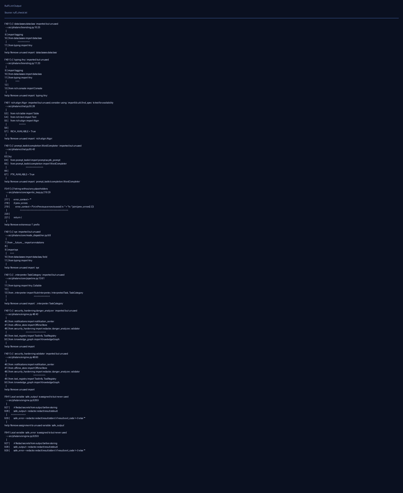
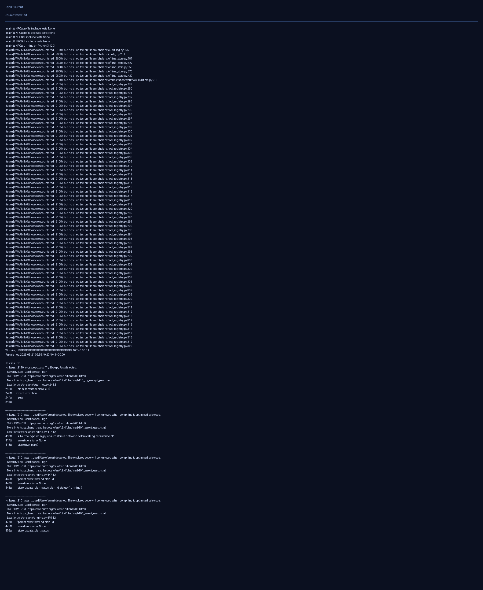
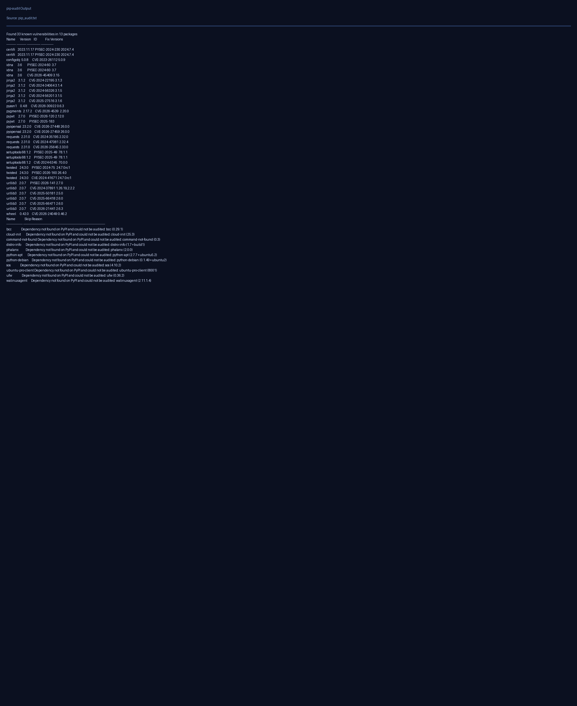

# Defensive Testing Evidence Report

Date (UTC): 2026-05-21
Repository: `mufthakherul/siyarix`
Scope: **Defensive-only validation** of this project (no offensive testing against live third-party targets).

## Safety and Scope Notes

- No offensive exploitation activity was performed.
- No unauthorized testing was performed on `mufthakherul.me`.
- Testing focused on repository quality and defensive security checks.

## Test Matrix

| Category | Command | Result |
|---|---|---|
| Lint | `ruff check src tests` | ❌ Failed (existing lint issues in repository) |
| Unit/Integration (local suite) | `pytest -q` | ✅ Passed (`127 passed`) |
| Static security analysis | `bandit -r src -f txt` | ⚠️ Findings present (11 low severity) |
| Dependency vulnerability audit | `pip-audit` | ⚠️ Findings present (33 known vulnerabilities in environment packages) |

## Command Outputs (Captured)

Raw artifacts were captured under `/tmp/siyarix-evidence/` during execution:

- `/tmp/siyarix-evidence/ruff_check.txt`
- `/tmp/siyarix-evidence/pytest_q.txt`
- `/tmp/siyarix-evidence/bandit.txt`
- `/tmp/siyarix-evidence/pip_audit.txt`

## Screenshot Evidence

### 1) Ruff lint check



### 2) Pytest suite execution


### 3) Bandit static security scan



### 4) pip-audit dependency scan



## Key Defensive Observations

1. The repository test suite is passing in this environment after ensuring async pytest support is available.
2. Lint output indicates pre-existing code-quality issues (unused imports and related warnings/errors).
3. Bandit reports low-severity findings that should be triaged and remediated over time.
4. pip-audit shows dependency vulnerabilities in the current environment package set; dependency upgrades should be scheduled.

## Reproducibility Commands

```bash
cd /home/runner/work/siyarix/siyarix
ruff check src tests
pytest -q
bandit -r src -f txt
pip-audit
```
